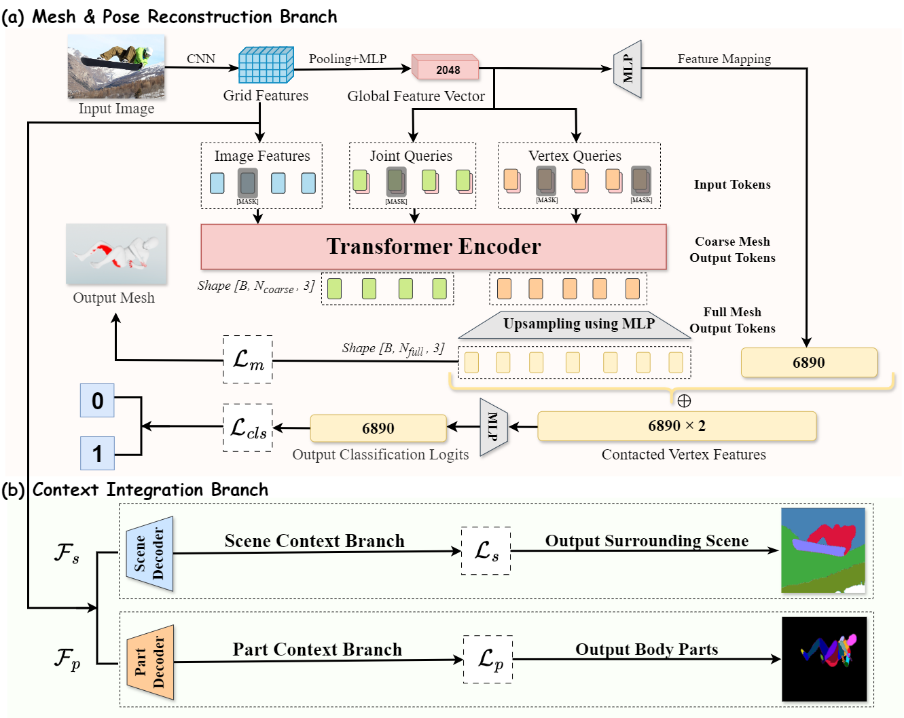
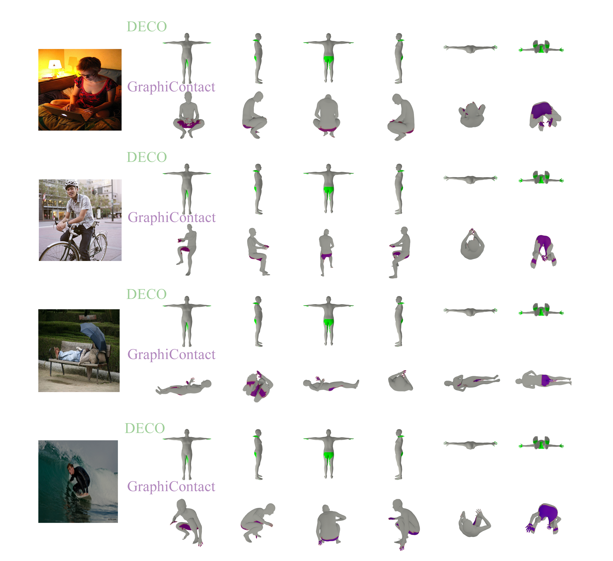

# ✨GraphiContact✨

We have to say that an important part of the code framework for this project refers to this article [Mesh Graphormer](https://arxiv.org/abs/2104.00272). If necessary, you can refer to this article and the open source code in it.

The GraphiContact model excels in 3D human body reconstruction and interaction analysis, using CNNs and graphormer encoders to predict contact points and 3D mesh coordinates. It achieves state-of-the-art results across multiple datasets, and its code has been open-sourced for academic and industrial use.

  
  

## Installation
Check [INSTALL.md](docs/INSTALL.md) for installation instructions.
For more detailed installation information, please refer to [requirements.txt](GraphiContact/requirements.txt)

## Model Zoo and Download
Please download our pre-trained models and other relevant files that are important to run our code. 

Check [DOWNLOAD.md](docs/DOWNLOAD.md) for details. 

## Quick demo
We provide demo codes to run end-to-end inference on the test images.

Check [DEMO.md](docs/DEMO.md) for details.

## Experiments
We provide python codes for training and evaluation.

Check [EXP.md](docs/EXP.md) for details.

## License

Our research code is released under the MIT license. See [LICENSE](LICENSE) for details. 

We use submodules from third parties, such as [huggingface/transformers](https://github.com/huggingface/transformers) and [hassony2/manopth](https://github.com/hassony2/manopth). Please see [NOTICE](NOTICE.md) for details. 

Our models have dependency with SMPL and MANO models. Please note that any use of SMPL models and MANO models are subject to **Software Copyright License for non-commercial scientific research purposes**. Please see [SMPL-Model License](https://smpl.is.tue.mpg.de/modellicense) and [MANO License](https://mano.is.tue.mpg.de/license) for details.

## Acknowledgments

Our implementation and experiments are built on top of open-source GitHub repositories. We thank all the authors who made their code public, which tremendously accelerates our project progress. If you find these works helpful, please consider citing them as well.

[microsoft/MeshGraphormer](https://github.com/microsoft/MeshGraphormer)

[sha2nkt/deco](https://github.com/sha2nkt/deco)

[astra-vision/PaSCo](https://github.com/astra-vision/PaSCo)

[huggingface/transformers](https://github.com/huggingface/transformers) 

[HRNet/HRNet-Image-Classification](https://github.com/HRNet/HRNet-Image-Classification) 

[nkolot/GraphCMR](https://github.com/nkolot/GraphCMR) 

[akanazawa/hmr](https://github.com/akanazawa/hmr) 

[MandyMo/pytorch_HMR](https://github.com/MandyMo/pytorch_HMR) 

[hassony2/manopth](https://github.com/hassony2/manopth) 

[hongsukchoi/Pose2Mesh_RELEASE](https://github.com/hongsukchoi/Pose2Mesh_RELEASE) 

[mks0601/I2L-MeshNet_RELEASE](https://github.com/mks0601/I2L-MeshNet_RELEASE) 

[open-mmlab/mmdetection](https://github.com/open-mmlab/mmdetection) 